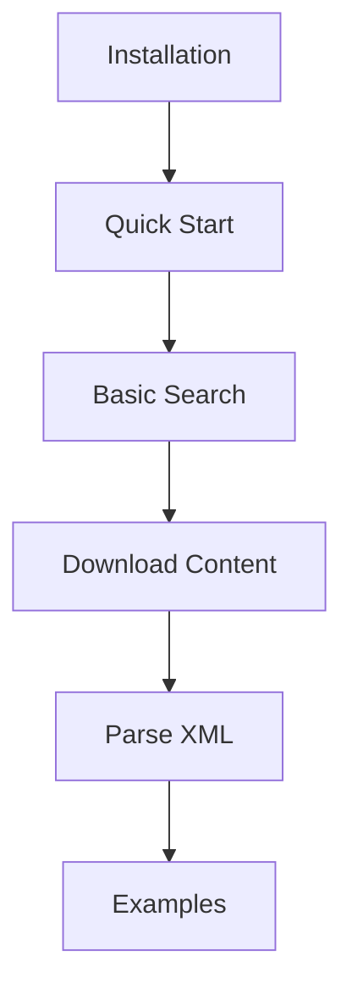
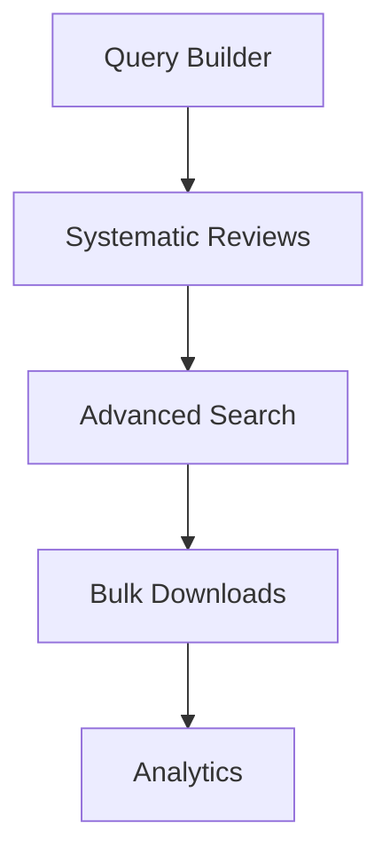
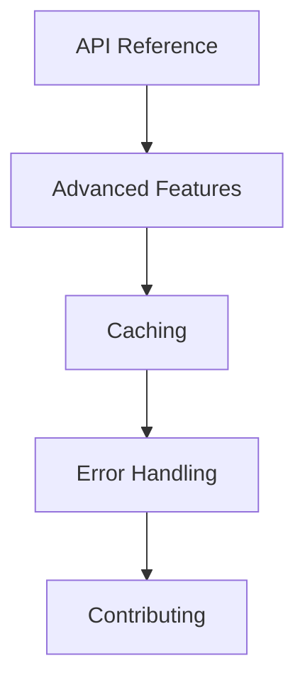

# PyEuropePMC Documentation

<div align="center">

[](https://www.python.org/downloads/)
[](https://opensource.org/licenses/MIT)
[](../tests/)

**Complete documentation for PyEuropePMC** - A robust Python toolkit for scientific literature analysis from Europe PMC

[🚀 Quick Start](getting-started/quickstart.md) • [📚 API Reference](api/) • [🎯 Examples](examples/) • [🗺️ Site Map](sitemap.md) • [GitHub](https://github.com/JonasHeinickeBio/pyEuropePMC)

</div>

---

## 📖 Documentation Overview

Welcome to the PyEuropePMC documentation! This site is organized to help you find what you need quickly, whether you're new to the library or a power user.

### 🗂️ Site Structure

```
📚 PyEuropePMC Documentation
├── 🚀 [Getting Started](getting-started/) - Installation & basics
│   ├── 📦 [Installation](getting-started/installation.md)
│   ├── ⚡ [Quick Start](getting-started/quickstart.md)
│   └── ❓ [FAQ](getting-started/faq.md)
├── ✨ [Features](features/) - What PyEuropePMC can do
│   ├── 🔍 [Search](features/search/)
│   ├── 🔧 [Query Builder](features/query-builder-load-save-translate.md)
│   ├── 📄 [Full-Text](features/fulltext/)
│   ├── 🔬 [XML Parsing](features/parsing/)
│   └── 📋 [Systematic Reviews](features/systematic-review-tracking.md)
├── 📚 [API Reference](api/) - Complete API docs
│   ├── 🔍 [SearchClient](api/search-client.md)
│   ├── 📄 [FullTextClient](api/fulltext-client.md)
│   ├── 📄 [ArticleClient](api/article-client.md)
│   ├── 🔬 [XML Parser](api/xml-parser.md)
│   └── 📦 [FTP Downloader](api/ftp-downloader.md)
├── 🎯 [Examples](examples/) - Code examples & use cases
├── ⚙️ [Advanced](advanced/) - Power user features
└── 🛠️ [Development](development/) - Contributing & development
```

---

## 🎯 Quick Navigation

| I want to... | Go to... | Time |
|--------------|----------|------|
| **Install PyEuropePMC** | [Installation](getting-started/installation.md) | 2 min |
| **Run my first search** | [Quick Start](getting-started/quickstart.md) | 5 min |
| **Search for papers** | [Search Features](features/search/) | 10 min |
| **Build complex queries** | [Query Builder](features/query-builder-load-save-translate.md) | 15 min |
| **Download PDFs/XML** | [Full-Text Retrieval](features/fulltext/) | 10 min |
| **Parse XML documents** | [XML Parsing](features/parsing/) | 15 min |
| **Extract metadata/tables** | [XML Parser API](api/xml-parser.md) | 20 min |
| **See working examples** | [Examples](examples/) | 10-30 min |
| **Optimize performance** | [Advanced Features](advanced/) | 20 min |
| **Contribute code** | [Development](development/) | 30 min |

---

## 🚀 Getting Started (Recommended Path)

<div class="getting-started-flow">

1. **📦 [Install](getting-started/installation.md)** (2 min)
   ```bash
   pip install pyeuropepmc
   ```

2. **⚡ [Quick Start](getting-started/quickstart.md)** (5 min)
   ```python
   from pyeuropepmc.search import SearchClient
   with SearchClient() as client:
       results = client.search("CRISPR", pageSize=10)
   ```

3. **🔍 [Explore Features](features/)** (10-30 min)
   - [Search](features/search/) - Query Europe PMC
   - [Full-Text](features/fulltext/) - Download content
   - [Parsing](features/parsing/) - Extract structured data

4. **📚 [API Reference](api/)** (as needed)
   - Complete method documentation
   - Parameter details & examples

</div>

---

## 📋 Feature Overview

### 🔍 **Search & Query**
- **Advanced Search**: Boolean operators, field-specific queries, date ranges
- **Query Builder**: Type-safe fluent API for complex queries (150+ fields)
- **Systematic Reviews**: PRISMA-compliant search logging and audit trails
- **Multiple Formats**: JSON, XML, Dublin Core output

### 📄 **Content Retrieval**
- **Full-Text Downloads**: PDFs, XML, HTML from open access articles
- **Bulk FTP**: Efficient large-scale downloads via FTP
- **Progress Tracking**: Real-time callbacks and status updates

### 🔬 **Data Extraction**
- **XML Parsing**: Extract metadata, tables, references from full-text XML
- **Format Conversion**: Convert to plaintext, Markdown, structured data
- **Schema Validation**: Analyze XML element coverage and completeness
- **Custom Patterns**: Flexible configuration for different XML schemas

### 📊 **Analytics & Processing**
- **Citation Analysis**: Publication metrics and citation statistics
- **Quality Assessment**: Open access status, PDF availability, completeness
- **Duplicate Detection**: Remove duplicate papers from result sets
- **Geographic Analysis**: Author affiliation and location analysis

### 🛠️ **Developer Features**
- **Type Safety**: Comprehensive type annotations and validation
- **Caching**: HTTP caching with configurable backends (memory, disk, Redis)
- **Error Handling**: Robust retry logic and detailed error messages
- **Rate Limiting**: Respectful API usage with configurable delays

---

## 🎓 Learning Paths

### 👨‍🎓 **For Beginners**


1. [Installation](getting-started/installation.md) → [Quick Start](getting-started/quickstart.md)
2. [Search Features](features/search/) → [Full-Text](features/fulltext/)
3. [Examples](examples/) → [API Reference](api/)

### 👨‍💼 **For Researchers**


1. [Query Builder](features/query-builder-load-save-translate.md) → [Systematic Reviews](features/systematic-review-tracking.md)
2. [Advanced Search](features/search/) → [Bulk Operations](features/fulltext/)
3. [Analytics](api/analytics-visualization.md) → [Performance](advanced/)

### 👨‍💻 **For Developers**


1. [API Reference](api/) → [Advanced](advanced/)
2. [Caching](advanced/caching.md) → [Performance](advanced/)
3. [Development](development/) → [Contributing](development/)

---

## 🔍 Search & Discovery

### By Topic

| Topic | Primary Location | Related |
|-------|------------------|---------|
| **Installation** | [Getting Started](getting-started/) | [FAQ](getting-started/faq.md) |
| **Search Queries** | [Search](features/search/) | [Query Builder](features/query-builder-load-save-translate.md) |
| **Full-Text** | [Full-Text](features/fulltext/) | [FTP Downloads](api/ftp-downloader.md) |
| **XML Parsing** | [Parsing](features/parsing/) | [XML Parser](api/xml-parser.md) |
| **Systematic Reviews** | [Reviews](features/systematic-review-tracking.md) | [Query Builder](features/query-builder-load-save-translate.md) |
| **Analytics** | [Analytics](api/analytics-visualization.md) | [Examples](examples/) |
| **Performance** | [Advanced](advanced/) | [Caching](advanced/caching.md) |
| **Contributing** | [Development](development/) | [GitHub](https://github.com/JonasHeinickeBio/pyEuropePMC) |

### By Task

| I need to... | Solution |
|--------------|----------|
| Find papers on a topic | [Search Features](features/search/) |
| Download PDFs in bulk | [FTP Downloader](api/ftp-downloader.md) |
| Extract tables from papers | [XML Parsing](features/parsing/) |
| Build reproducible searches | [Systematic Reviews](features/systematic-review-tracking.md) |
| Analyze citation patterns | [Analytics](api/analytics-visualization.md) |
| Optimize API performance | [Caching](advanced/caching.md) |
| Handle API errors | [Error Handling](advanced/error-handling.md) |

---

## 📦 What's New in v1.11.3

### ✨ **Major Features**
- **Advanced Analytics**: Citation analysis, quality metrics, duplicate detection
- **HTTP Caching**: Configurable caching backends with conditional requests
- **RDF Conversion**: Convert papers to knowledge graphs with RML mappings
- **Type-Safe Query Builder**: 150+ searchable fields with validation
- **Bulk Operations**: Efficient large-scale content retrieval

### 🔧 **Improvements**
- **Modular Architecture**: Better code organization and maintainability
- **Enhanced Testing**: 200+ tests with 90%+ coverage
- **CI/CD Pipeline**: Automated quality assurance and deployment
- **Documentation**: Comprehensive guides and examples

See [CHANGELOG](../CHANGELOG.md) for complete version history.

---

## 🆘 Getting Help

### Quick Help
- **❓ [FAQ](getting-started/faq.md)** - Common questions answered
- **💡 [Examples](examples/)** - Working code samples
- **🐛 [GitHub Issues](https://github.com/JonasHeinickeBio/pyEuropePMC/issues)** - Bug reports & support

### Community Support
- **📖 [Europe PMC API Docs](https://europepmc.org/RestfulWebService)** - Official API reference
- **📦 [PyPI Package](https://pypi.org/project/pyeuropepmc/)** - Package details
- **💻 [GitHub Repository](https://github.com/JonasHeinickeBio/pyEuropePMC)** - Source code

### Report Issues
Found a bug or need help? [Create an issue](https://github.com/JonasHeinickeBio/pyEuropePMC/issues/new) with:
- Python version and PyEuropePMC version
- Minimal code to reproduce the issue
- Error messages and stack traces

---

## 🔗 External Links

- **[Europe PMC](https://europepmc.org/)** - The database PyEuropePMC accesses
- **[REST API](https://europepmc.org/RestfulWebService)** - Official API documentation
- **[GitHub](https://github.com/JonasHeinickeBio/pyEuropePMC)** - Source code and development
- **[PyPI](https://pypi.org/project/pyeuropepmc/)** - Package distribution

---

<div align="center">

**📚 [Browse All Documentation](#) • 🚀 [Quick Start](getting-started/quickstart.md) • 💡 [Examples](examples/)**

---

**[⬆ Back to Top](#pyeuropepmc-documentation)**

*Made with ❤️ by the PyEuropePMC team • Licensed under [MIT](../LICENSE)*

</div>
