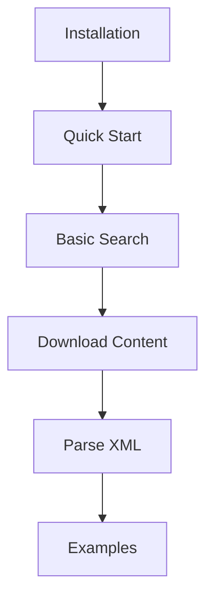
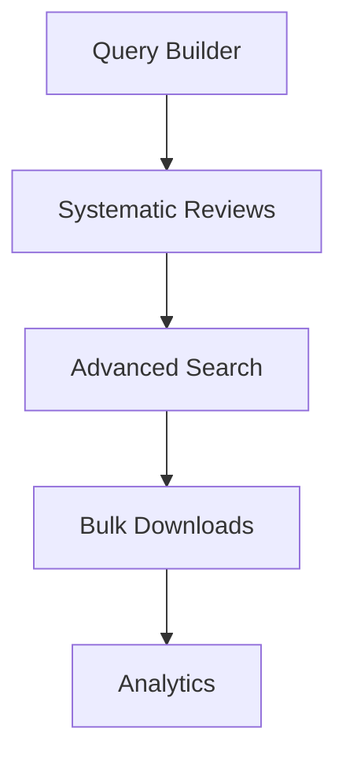
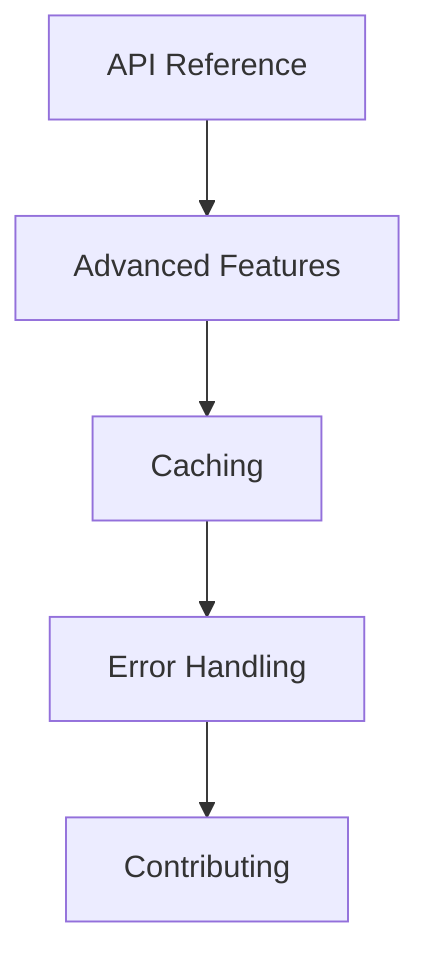

# PyEuropePMC Documentation

<div align="center">

[](https://www.python.org/downloads/)
[](https://opensource.org/licenses/MIT)
[](../tests/)

**Complete documentation for PyEuropePMC** - A robust Python toolkit for scientific literature analysis from Europe PMC

[Quick Start](getting-started/quickstart.md) • [API Reference](api/) • [Examples](examples/) • [Site Map](sitemap.md) • [GitHub](https://github.com/JonasHeinickeBio/pyEuropePMC)

</div>

---

## Documentation Overview

Welcome to the PyEuropePMC documentation. This site is organized to help you find information efficiently, whether you are new to the library or an experienced user.

### Site Structure

```
PyEuropePMC Documentation
├── Getting Started - Installation and basic usage
│   ├── Installation
│   ├── Quick Start
│   └── FAQ
├── Features - Core capabilities
│   ├── Search
│   ├── Query Builder
│   ├── Full-Text Retrieval
│   ├── XML Parsing
│   └── Systematic Reviews
├── API Reference - Complete API documentation
│   ├── SearchClient
│   ├── FullTextClient
│   ├── ArticleClient
│   ├── XML Parser
│   └── FTP Downloader
├── Examples - Code examples and use cases
├── Advanced - Advanced features and optimization
└── Development - Contributing and development guide
```

---

## Quick Navigation

| Task | Documentation | Estimated Time |
|------|---------------|----------------|
| Install PyEuropePMC | [Installation](getting-started/installation.md) | 2 minutes |
| Run your first search | [Quick Start](getting-started/quickstart.md) | 5 minutes |
| Search for papers | [Search Features](features/search/) | 10 minutes |
| Build complex queries | [Query Builder](features/query-builder-load-save-translate.md) | 15 minutes |
| Download PDFs and XML | [Full-Text Retrieval](features/fulltext/) | 10 minutes |
| Parse XML documents | [XML Parsing](features/parsing/) | 15 minutes |
| Extract metadata and tables | [XML Parser API](api/xml-parser.md) | 20 minutes |
| Review working examples | [Examples](examples/) | 10-30 minutes |
| Optimize performance | [Advanced Features](advanced/) | 20 minutes |
| Contribute code | [Development](development/) | 30 minutes |

---

## Getting Started

### Recommended Learning Path

1. **Installation** (2 minutes)
   
   Install PyEuropePMC using pip:
   ```bash
   pip install pyeuropepmc
   ```
   
   See the [Installation Guide](getting-started/installation.md) for detailed instructions.

2. **Quick Start** (5 minutes)
   
   Begin with a basic search:
   ```python
   from pyeuropepmc.search import SearchClient
   with SearchClient() as client:
       results = client.search("CRISPR", pageSize=10)
   ```
   
   Refer to the [Quick Start Guide](getting-started/quickstart.md) for complete examples.

3. **Explore Core Features** (10-30 minutes)
   - [Search](features/search/) - Query the Europe PMC database
   - [Full-Text](features/fulltext/) - Download article content
   - [Parsing](features/parsing/) - Extract structured data from XML

4. **API Reference** (as needed)
   - Complete method documentation
   - Parameter specifications and examples

---

## Feature Overview

### Search and Query
- **Advanced Search**: Boolean operators, field-specific queries, and date ranges
- **Query Builder**: Type-safe fluent API supporting 150+ searchable fields
- **Systematic Reviews**: PRISMA-compliant search logging and audit trails
- **Multiple Formats**: JSON, XML, and Dublin Core output formats

### Content Retrieval
- **Full-Text Downloads**: Access to PDFs, XML, and HTML from open access articles
- **Bulk FTP**: Efficient large-scale downloads via FTP servers
- **Progress Tracking**: Real-time callbacks and status monitoring

### Data Extraction
- **XML Parsing**: Extract metadata, tables, and references from full-text XML
- **Format Conversion**: Convert to plaintext, Markdown, or structured data formats
- **Schema Validation**: Analyze XML element coverage and document completeness
- **Custom Patterns**: Flexible configuration for different XML schemas

### Analytics and Processing
- **Citation Analysis**: Publication metrics and citation statistics
- **Quality Assessment**: Evaluate open access status, PDF availability, and data completeness
- **Duplicate Detection**: Identify and remove duplicate papers from result sets
- **Geographic Analysis**: Analyze author affiliations and geographic distribution

### Developer Features
- **Type Safety**: Comprehensive type annotations and runtime validation
- **Caching**: HTTP caching with configurable backends (memory, disk, Redis)
- **Error Handling**: Robust retry logic with detailed error messages
- **Rate Limiting**: Respectful API usage with configurable delays

---

## Learning Paths

The documentation is organized to serve different user roles and experience levels.

### For Beginners

Recommended progression for new users:



1. [Installation](getting-started/installation.md) → [Quick Start](getting-started/quickstart.md)
2. [Search Features](features/search/) → [Full-Text](features/fulltext/)
3. [Examples](examples/) → [API Reference](api/)

### For Researchers

Focused on systematic review and analysis workflows:



1. [Query Builder](features/query-builder-load-save-translate.md) → [Systematic Reviews](features/systematic-review-tracking.md)
2. [Advanced Search](features/search/) → [Bulk Operations](features/fulltext/)
3. [Analytics](api/analytics-visualization.md) → [Performance](advanced/)

### For Developers

Technical documentation and integration guides:



1. [API Reference](api/) → [Advanced](advanced/)
2. [Caching](advanced/caching.md) → [Performance](advanced/)
3. [Development](development/) → [Contributing](development/)

---

## Search and Discovery

### By Topic

| Topic | Primary Location | Related Documentation |
|-------|------------------|----------------------|
| Installation | [Getting Started](getting-started/) | [FAQ](getting-started/faq.md) |
| Search Queries | [Search](features/search/) | [Query Builder](features/query-builder-load-save-translate.md) |
| Full-Text Retrieval | [Full-Text](features/fulltext/) | [FTP Downloads](api/ftp-downloader.md) |
| XML Parsing | [Parsing](features/parsing/) | [XML Parser](api/xml-parser.md) |
| Systematic Reviews | [Reviews](features/systematic-review-tracking.md) | [Query Builder](features/query-builder-load-save-translate.md) |
| Analytics | [Analytics](api/analytics-visualization.md) | [Examples](examples/) |
| Performance | [Advanced](advanced/) | [Caching](advanced/caching.md) |
| Contributing | [Development](development/) | [GitHub](https://github.com/JonasHeinickeBio/pyEuropePMC) |

### By Task

| Task | Solution |
|------|----------|
| Find papers on a topic | [Search Features](features/search/) |
| Download PDFs in bulk | [FTP Downloader](api/ftp-downloader.md) |
| Extract tables from papers | [XML Parsing](features/parsing/) |
| Build reproducible searches | [Systematic Reviews](features/systematic-review-tracking.md) |
| Analyze citation patterns | [Analytics](api/analytics-visualization.md) |
| Optimize API performance | [Caching](advanced/caching.md) |
| Handle API errors | [Error Handling](advanced/error-handling.md) |

---

## Version History

### Version 1.11.3

#### Major Features
- **Advanced Analytics**: Citation analysis, quality metrics, and duplicate detection
- **HTTP Caching**: Configurable caching backends with conditional request support
- **RDF Conversion**: Convert papers to knowledge graphs using RML mappings
- **Type-Safe Query Builder**: Access to 150+ searchable fields with validation
- **Bulk Operations**: Efficient large-scale content retrieval

#### Improvements
- **Modular Architecture**: Enhanced code organization and maintainability
- **Enhanced Testing**: Over 200 tests with greater than 90% code coverage
- **CI/CD Pipeline**: Automated quality assurance and deployment
- **Documentation**: Comprehensive guides and examples

See the [CHANGELOG](../CHANGELOG.md) for complete version history.

---

## Support and Resources

### Documentation Resources
- [FAQ](getting-started/faq.md) - Frequently asked questions and answers
- [Examples](examples/) - Working code samples and use cases
- [GitHub Issues](https://github.com/JonasHeinickeBio/pyEuropePMC/issues) - Bug reports and feature requests

### External Resources
- [Europe PMC API Documentation](https://europepmc.org/RestfulWebService) - Official API reference
- [PyPI Package](https://pypi.org/project/pyeuropepmc/) - Package information and installation
- [GitHub Repository](https://github.com/JonasHeinickeBio/pyEuropePMC) - Source code and development

### Reporting Issues

To report bugs or request features, please [create an issue](https://github.com/JonasHeinickeBio/pyEuropePMC/issues/new) with the following information:
- Python version and PyEuropePMC version
- Minimal code to reproduce the issue
- Error messages and stack traces

---

## External References

- [Europe PMC](https://europepmc.org/) - The literature database accessed by PyEuropePMC
- [REST API](https://europepmc.org/RestfulWebService) - Official API documentation
- [GitHub](https://github.com/JonasHeinickeBio/pyEuropePMC) - Source code and development
- [PyPI](https://pypi.org/project/pyeuropepmc/) - Package distribution

---

<div align="center">

[Browse All Documentation](#) • [Quick Start](getting-started/quickstart.md) • [Examples](examples/)

---

[Back to Top](#pyeuropepmc-documentation)

*Licensed under [MIT](../LICENSE) • PyEuropePMC Team*

</div>
